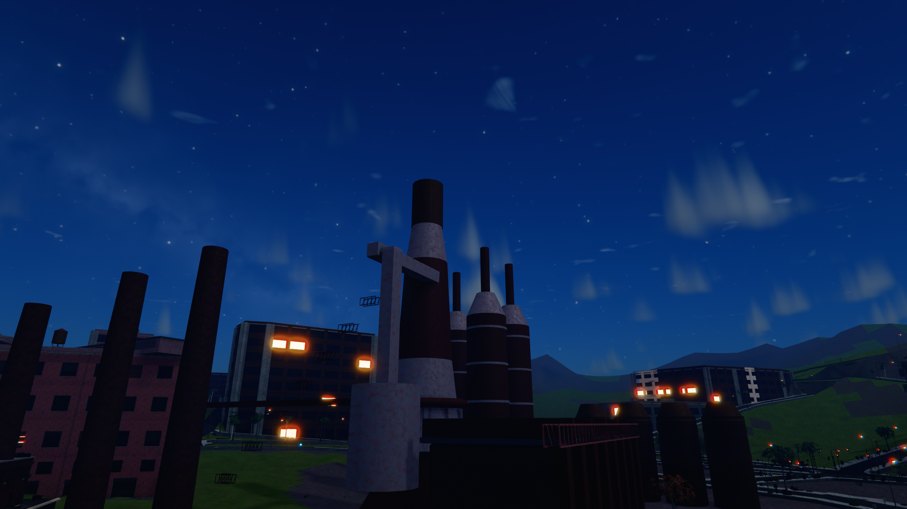
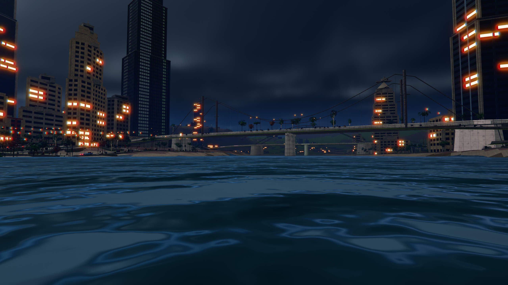

# Steel City — screenshots

**DeCarlo Boyz** — an open-world game built in Three.js. Everything here is
generated at runtime: no art files, no textures on disk, no CDN, no network.
The city, its materials, its vehicles and its three brothers are all
procedural, and the whole thing runs in a browser tab.

Captured at 2560x1440 by `node tools/screenshots.mjs`. The capture path is
deterministic — lockstep frames, a frozen simulation at the shutter and a
work-budgeted streaming build — so two runs of an unchanged tree produce
byte-identical images.

### Downtown from the Mt. Washington clifftop

*The signature view: the Golden Triangle read across the Monongahela at golden hour.*

### Downtown in a storm

*Wet asphalt, lit windows, and traffic that was deliberately left in.*

### The Old Blast Furnace

*Slag orange against cold steel in river fog — the thematic heart of a rustbelt city.*

### Police searchlight

*Five stars, and a helicopter sweeping the street below.*

### A tied-arch bridge at last light

*Three rivers and forty bridges, in one frame.*

### The Duquesne Incline at dawn

*The funicular climbing out of river fog.*

### The Point

*Where three rivers meet.*

### Dylan's Kessel GT

*A front-drive fastback — the fast brother’s own car.*

### A Golden Triangle avenue

*Clear afternoon light, at street level.*
